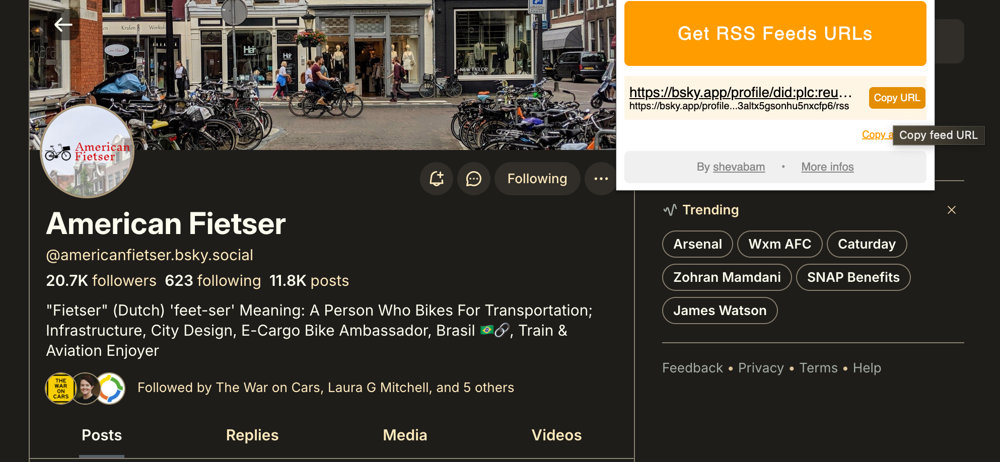

Podcasts are nice. They show up in chronological order, download in the background, and work the same in every app. In a world of algorithmic walled garden social "platforms", this is a small miracle.

Why can't more of the internet be like that? As [Yair Rosenberg wrote in 2023](https://www.theatlantic.com/ideas/archive/2023/03/social-media-algorithms-twitter-meta-rss-reader/673282/), you can take back control of what you see on the internet.

## It's just RSS

The technology of a hopeful future actually came out in 1999. It's just [RSS](https://en.wikipedia.org/wiki/RSS). Every morning I fire up [NetNewsWire](https://netnewswire.com/). I pick something, open it up, and read it. Nobody tracks me. There are no cookie policies to accept. There's no like button or comment section.

In the days before profit motives overwhelmed product design, humans understood that the media you wanted to access had very little to do with the "platform" it was distributed by.

Imagine Youtube videos and Instagram comments and new issues of your local newsblog all just appear in one chronological feed. The obvious problem with all this control is that nobody can sell ads or harvest your personal data if you're safe in your own third party app (Outside of a web browser! Offline, even!).

## Podcast freedom: fleeting

Even podcasts may not have this freedom forever as companies try to capture the remaining frontier. The New York Times is taking steps to force listeners into their own app. Spotify made major plays in the last few years to get exclusive podcasts behind their paywall. Podcasters now implore that you watch their episodes on YouTube, where they can more effectively monetize and dissect a larger stream of analytic data. Eyeballs, baby.

It's perfectly reasonable to want subscribers to pay for your content. Substack and Patreon are positive role models for how this should work: You give them cash and they give you an individualized subscription link to import the feed in your own app. The ads you hear are at the discretion of the creator, not the platform.

## Hunting for ghost feeds

Despite the incentives for companies to keep you on their site, looking at their ads and contributing to their engagement metrics, RSS doggedly persists. Idealistic developers have built RSS into most of the content management platforms (like Wordpress) that media use (mostly without paying). Some, like The Atlantic, even publish articles paywall-free, though the feeds are tough to find.

I've been using a chrome extension called [Get RSS Feed URL](https://chromewebstore.google.com/detail/get-rss-feed-url/kfghpdldaipanmkhfpdcjglncmilendn) that helps surface hidden feeds. It works in places you might not even expect, like Bluesky.

## Conscious of content

Adopting an RSS-first means of consuming the web takes work, and the setup user experience can be rough. The exercise, though, can be enlightening. You might have a sense of how much _time_ you spend on your phone in a day, but where is that time spent?

The content of my media diet have changed a bit in the last 6 months since I went all-in on RSS. It took real effort, but now, when I open my phone, I reach for my RSS reader rather than a browser or a social app. It feels like an improvement.