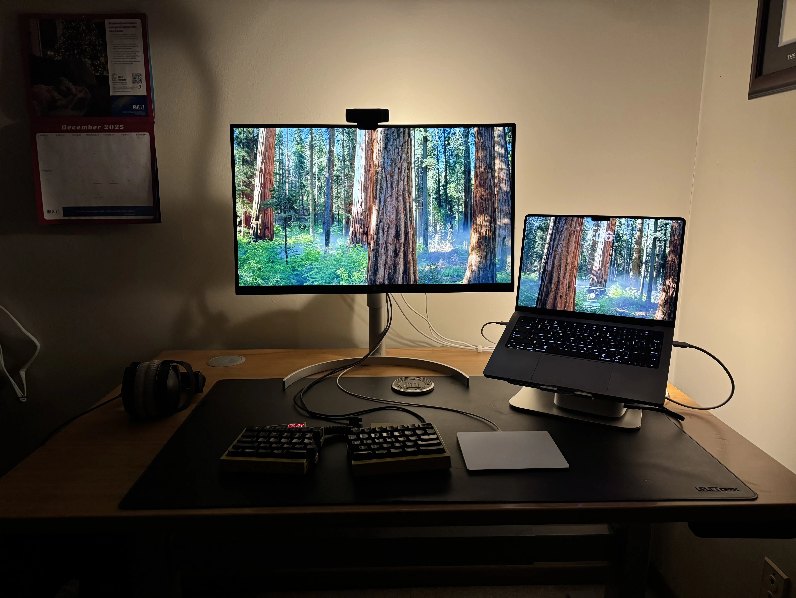
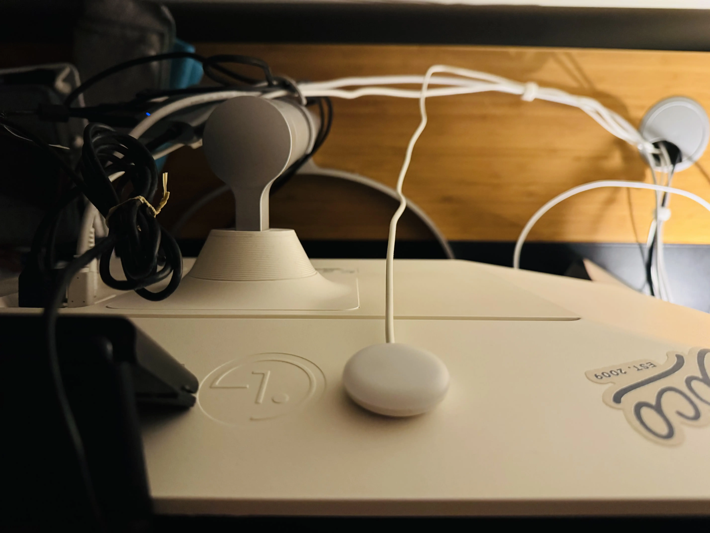

The [IKEA Kapplake accent light](https://www.ikea.com/us/en/p/kapplake-led-spotlight-white-30543166/) works really well as a backlight.

Compared with the picture above, it looks a bit softer and warmer in person. The entire light is a toggle button, so I've put them toward the top and right side so they're easy to reach.

(Yes, that is a [UHK](https://uhk.io/))

Behind the laptop stand

Behind the monitor 

Box does not include a USB A power source, but surely you have a dozen of those by now.