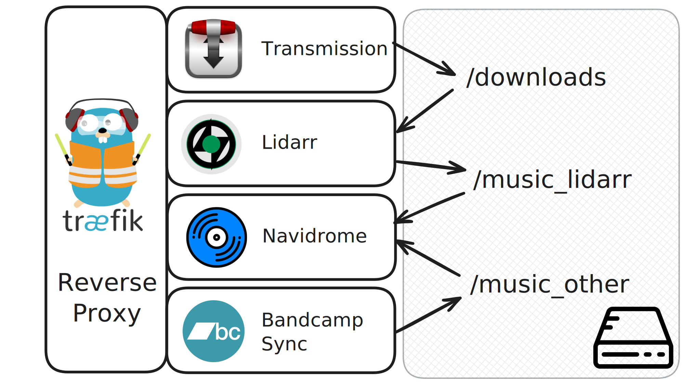
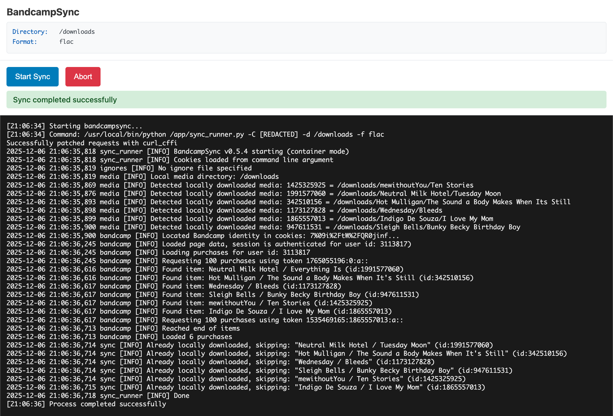

## Why is buying music so inconvenient?

It's kind of insane that setting up a piracy stack is somehow easier than regularly purchasing and downloading music in a way that supports the artist.

Read [this setup guide](https://ndeast.com/posts/death-to-spotify/#) for example. Toward the bottom of that article, Nik documents his end-to-end purchase workflow. It's horrible. It takes ~10 manual steps and 4 different websites to... buy an album.

There are powerful, convenient tools for stealing (which I use!) But if you want to buy things, the only platform not aggressively doing vendor ecosystem lock-in is Bandcamp. It has no consumer-facing API, its app kinda sucks, and there's no good way to grab your purchases except one-at-a-time through the browser.

## Metadata management

Serving music files is trivially easy. The metadata management is what gets ya.

A lot of music doesn't fit neatly into the album model (singles, collabs, compilation albums, live recordings) and 2 main tools attempt to help you organize your library.

Lidarr solves these things somewhat clumsily by hammering them into its exising album model, but it has worked well enough for me.

### Lidarr vs Beets

Lidar is primarily a piracy tool (it's a [servARR](https://wiki.servarr.com/) after all) and [Beets](https://beets.io/) is primarily a metadata management tool, so I started out trying to use Beets as my primary library manager. 

There's no good web interface for beets. [beets-flask](https://github.com/pSpitzner/beets-flask) shows a lot of potential but it's too immature to use with a big collection yet.  It only supports copy import and the interface quickly clutters with imported media.  You end up with a lot of directories to deal with.  Beets itself has a steep lerning curve and too much reliance on a magical plugin system. It's hard to heal the metadata DB if you fuck something up.

Some people (including me) have tried a `torrent -> lidarr -> beets -> server` but that violated my KISS needs.

I ended up using Beets to get my library in shape, then, once the file structure and file names were reliably consistent with MusicBrainz data, I pointed Lidarr at the same libraray directory and rebuilt it inside Lidarr. Its metadata management is good enough for me.

## The one-click workflow

Until bandcamp build webhooks (fat chance), you need at least 1 click to trigger a re-scan of your purchases.

* Buy an album on Bandcamp
* Swap over to my Bandcamp Sync Flask instance and click "Run sync". It pulls every purchase into the same shared library directory that Lidarr uses.
* Everything else is automated by Lidarr and Navidrome. Bandcamp albums are sufficiently enriched that Lidarr can figure out what to do with them on its own.

Stuff should appear in your media player within a minute or two. This obviously doesn't work if the thing you bought is too obscure to have landed in MusicBrainz yet, but I'm not enough of a hipster to be buying albums like that.

## The repo: Bandcamp Sync Flask

https://github.com/subdavis/bandcamp-sync-flask

Credit and kudos to [BandcampSync](https://github.com/subdavis/bandcamp-sync-flask?tab=readme-ov-file) which is the script this app wraps.

## Comments

Hastings Greer wrote:
All this fuss about metadata seems like unneeded headache. A music library should be listened to on global shuffle, and if the RNG takes you straight from "Carolina in my Mind" to "Stupid Horse" then is that so bad?