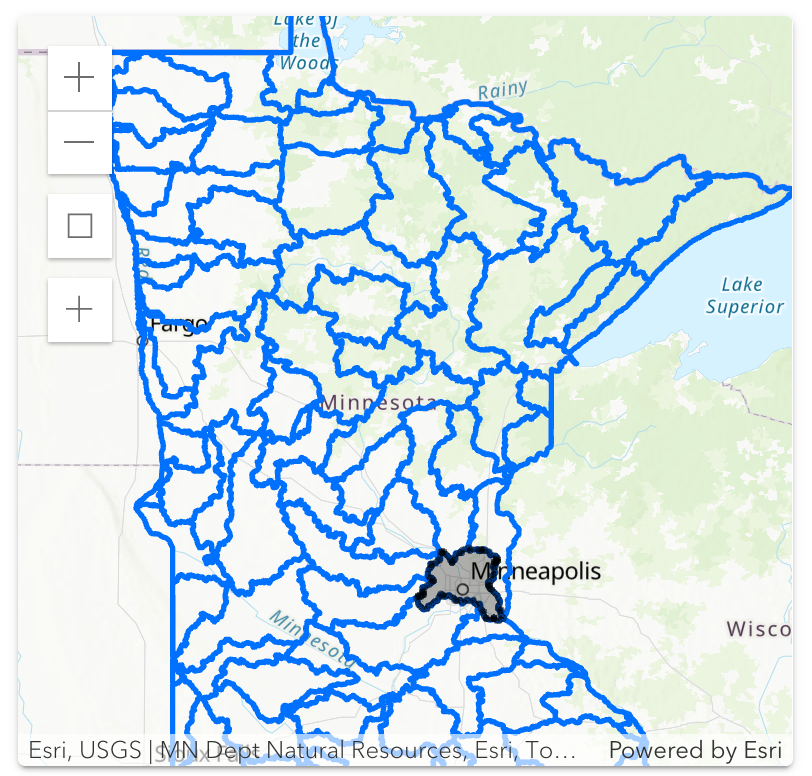

## What does winter feel like

I'm a transplant from the southeast, and I hear a lot about how winters in Minnesota are [nothing like they used to be](https://www.reddit.com/r/TwinCities/comments/1oh38gt/winters_are_not_what_they_used_to_be/). 

Everyone knows the climate is changing, but averages and trendlines can be hard to relate to subjective personal experience. The average annual temperature in Minnesota has increased by 3.2°F[^1] between 1895 and 2024, but a ~0.5 degree increase on average every 10 years is not something you notice year to year.

Still, we're experiencing climate change. That mostly means more variable weather patterns. Bigger swings, not just steady warming. Can we see that in the data?

## Snowfall trends

Snowfall is the top driver of how a winter _feels_.

There are some trends in first-order measures of snowfall, but they may not be what you expect. Both total snowfall and variability from winter to winter are **increasing**. Variability is actually down somewhat since an elevated period from about 1970 to 2010.

My rolling standard deviation is somewhat arbitrary, so I included both a 20 year and a 30 year to show sensitivity to the window size.



Let's check how many snow days there were, and how much of the winter included ground cover.

There is a clear **decreasing trend** of days with ground cover, but it's actually falling back toward levels from the early 20th century from a peak in the 50s.



I also looked at freeze-thaw cycles and "snow cycles", the number of times snow cover appears and disappears completely, which I just made up. These have both remained **relatively stable** and **very weakly correlated**.

An R value of 0.12 can be read as "Time (or, climate change) explains only 1.5% of the variation in snowfall totals. The other 98.5% is random year-to-year variation". 



## Temperature variability

Winter **low** temperatures are less stable and **warming faster** than other parts of the year.



In context, the global warming rate is about +0.36°F per decade since 1982[^2].

## Conclusion

I have a hard time reconciling the idea that winters are "not what they used to be" with this data. There is so much long-term variability that any single person's childhood experience is more likely to be selective memory (e.g., remembering the really snowy winters and forgetting the mild ones) than an indicator of climage-change-driven trends.

## Explore yourself

You can do a lot using the [DNR Minnesota Climate Explorer](https://climate-explorer.dnr.state.mn.us/main/historical). For some of my own analysis, I verified my numbers against their tool.

| Watershed map | Temperature trends |
| ------------- | ------------------ |
 |  |

### Data and Analysis Tools

All the data and code used for this post is available on [my GitHub](https://github.com/subdavis/subdavis.github.io/tree/main/content/posts/2025-12-twin-cities-climate). I've mainly used Python with Pandas and Chart.js for the visualizations.

The Minnesota DNR provides histoirical daily climate data going back to the 1870s [on their website](https://www.dnr.state.mn.us/climate/twin_cities/listings.html). The downloads are all broken, but I was able to scrape them directly and explain how in the code repository `README.md`.

### Disclaimer

I'm not a climate scientist or a statistician or anything like that. "How does winter feel" is obviously subjective and totally different from asking about whether the linear regression of average annual temperature is statistically significant.

[^1]: [Minnesota Climate Change Trends](https://climate.umn.edu/MNclimate)
[^2]: [NOAA Climate.gov](https://www.climate.gov/news-features/understanding-climate/climate-change-global-temperature)
