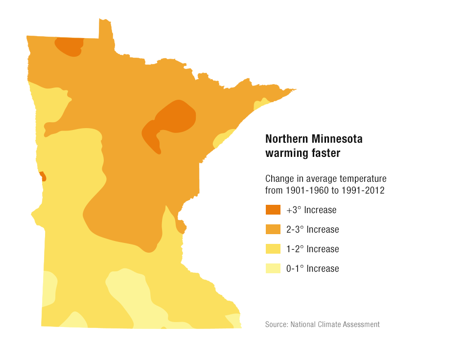
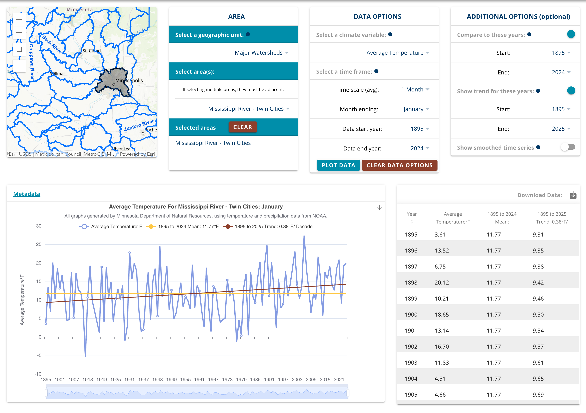

## What does winter feel like

I sometimes hear about how winters are [nothing like they used to be](https://www.reddit.com/r/TwinCities/comments/1oh38gt/winters_are_not_what_they_used_to_be/). Were they really [worse in the 80s](ttps://1037theloon.com/minnesota-winters-really-were-worse-in-the-70s-80s/)?

Memory is foggy. Averages and trendlines can be hard to relate to subjective personal experience. The average annual temperature in Minnesota has [increased by 3.2°F](https://climate.umn.edu/MNclimate) between 1895 and 2024, but a ~0.5 degree per decade increase is not easy to feel year to year.

Still, the Twin Cities are experiencing climate change. That mostly means more variable weather patterns. Bigger swings, not just steady warming. Can we see that in the data?

## Snowfall trends

Snowfall is probably the biggest factor for of how a winter is remembered.

There are some trends in first-order measures of snowfall, but they may not be what you expect. Both total snowfall and variability from winter to winter are **increasing**. Variability is actually down somewhat since an elevated period from about 1970 to 2010.

My rolling standard deviation is somewhat arbitrary, so I included both a 20 year and a 30 year to show sensitivity to the window size.



Something to keep in mind here is that regional seasonal snowfall is **not normally distributed**. The curve is skewed right, with a longer tail of very snowy winters.



My use of standard deviation above isn't quite correct, so let's try a box plot instead.



Let's check how many snow days there were, and how much of the winter included ground cover.

There is a clear **decreasing trend** of days with ground cover, but it's actually falling back toward levels from the early 20th century from a peak in the 50s.



I also looked at freeze-thaw cycles and "snow cycles", the number of times snow cover appears and disappears completely, which I just made up. These have both remained **relatively stable** and **very weakly correlated**.



This is actually pretty interesting. Fewer days with snow on the ground, and fewer total days with snowfall, but the same number of melt cycles, implies that snow used to just... last longer? But with the same-ish number of snowstorms?



Ok yeah that seem right.

## Temperature variability

Winter **low** temperatures are less stable and **warming faster** than other parts of the year.



In context, the global warming rate is [about +0.36°F per decade since 1982](https://www.climate.gov/news-features/understanding-climate/climate-change-global-temperature). Northern Minnesota is warming even faster.

## Lake Ice

> Minnesota’s lake ice season decreased by up to 14 days over the last ~50 years. Compared to 50 years ago, the average July-August surface water temperatures on Minnesota lakes are 3.0 – 3.9 degrees warmer.

[Source: Minnesota Pollution Control Agency (PCA)](https://www.pca.state.mn.us/news-and-stories/mpca-dnr-minnesotas-lake-ice-season-decreased-by-up-to-14-days-due-to-climate-change)

## Summary

Winter is changing in ways you might not expect.

* Temperatures are rising at rates I would describe as both alarmingly fast and difficult to perceive.
* The lake ice season is shrinking.
* Snow patterns are highly variable since tracking began in 1880. A big bump in latter half the 20th century makes the last 30 years of decline seem steeper than it would be in absolute historic terms.

## Footnotes and methods

You can do a lot using the [DNR Minnesota Climate Explorer](https://climate-explorer.dnr.state.mn.us/main/historical). For some of my own analysis, I verified my numbers against their tool.

### Data and Analysis Tools

All the data and code used for this post is available on [GitHub](https://github.com/subdavis/subdavis.github.io/tree/main/content/posts/2025-12-twin-cities-climate). I've mainly used Python with Pandas and Chart.js for the visualizations.

The Minnesota DNR provides histoirical daily climate data going back to the 1870s [on their website](https://www.dnr.state.mn.us/climate/twin_cities/listings.html). The downloads are all broken, but I was able to scrape them directly and explain how in the code repository `README.md`.

### The 1970s pivot

Climate trend lines (like the ones above) intended to show deviation from historical patterns often begin in the 1970s without explaining why.

* 1950(ish) is considered the inflection point of human-caused greenhouse gas emmisions.
* Until the 1970s, the effects of arisols in the atmosphere artifically suppressed those trends a bit.

The amount of CO2 in the atmosphere, [measured continuously at Mauna Loa Observatory since 1958](https://gml.noaa.gov/ccgg/trends/data.html), is a startlingly smooth curve.



### Disclaimer

I'm not a climate scientist or a statistician. I was interested in seeing second-order measures of variability that I've never really seen discussed in an emperical way.

