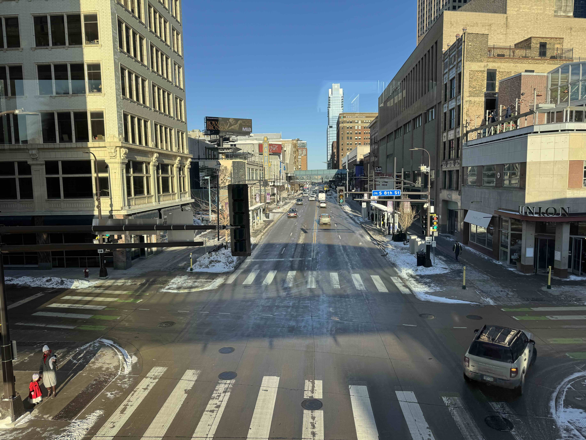

I celebrated the new year by having covid and coughing a lot. It caused us to cancel a lot of plans with friends and family and cut holiday travel short.

2025 was good to me, though.

1. I married my wonderful partner of 10 years in June. The joy and gratitude I feel overwhelms everything else that happend this year.
1. My favorite place to be is still on a bicycle in the woods. The consistency of this fact is comforting.
1. I want to build a writing habit. Got a jump start on this last November, but I'd be satisfied with producing 2-3 short posts a month consistently.
1. I over-indexed this past year on trying to solve my device addiction by selectively cutting out specific websites. Live and learn. I'll try something else and try to be patient about it.

My favorite book this year was the novella [The River Has Roots](https://www.goodreads.com/book/show/211004176-the-river-has-roots) by Amal El-Mohtar (who also wrote another favorite, [This is How You Lose the Time War](https://en.wikipedia.org/wiki/This_Is_How_You_Lose_the_Time_War))

I also especially enjoyed [The Cold Millions](https://www.goodreads.com/book/show/50358038-the-cold-millions) by Jess Walter, an novel about turn-of-the-century labor organizing across the pacific northwest and midwest.

I listened pretty incessantly to [_Ten Stories_](https://mewithoutyou.bandcamp.com/album/ten-stories) by mewithoutYou.

> Ten Stories is an allegorical collection of songs that, at first listen, follows a winding narrative about a circus train crash in 19th century Montana.

The song _Nine Stories_ feels most vivid in heavy Minnesota snow.

Late 1800s midwestern Americana has loomed large in my imagination for some reason this year.

