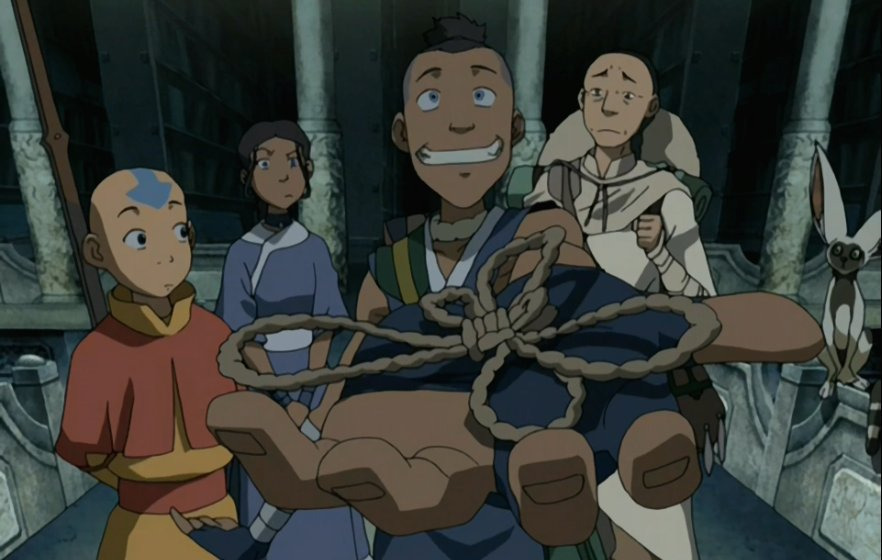

Anna's Archive last month announced plans to "back up spotify" in a [detailed blog post](https://annas-archive.org/blog/backing-up-spotify.html) that received a lot of attention.

> For now this is a torrents-only archive aimed at preservation, but if there is enough interest, we could add downloading of individual files to Anna’s Archive. Please let us know if you’d like this.

Discussion in most communities could be summarized as ["gimme gimme"](https://www.reddit.com/r/Annas_Archive/comments/1psb4qi/yes_yes_wed_like_this/), but [some](https://www.reddit.com/r/Music/comments/1puwoao/spotify_confirms_annas_archive_as_scraped_300tb/) [commenters](https://www.reddit.com/r/DataHoarder/comments/1prqheo/spotify_scraped_and_archived_300tb_of_music_files/) [seemed wise](https://news.ycombinator.com/item?id=46338339) to the heightened risk that this greater notoriety put the entire written archive at. Some even came to the same conclusion I do here.

## Music is not difficult to access, purchase, or own

None of the pirate's typical complaints about digital media really apply to music. It's cheap and easy to access half a dozen different streaming platforms. None are overly degraded by intrusive advertising. There is no DRM or platform lock-in problem to prevent buyers from truly owning their purchases, and FLAC is widely available.

And unlike the 90s, nobody's forcing you to buy full albums when all you wanted was the single. You can get 'em for $1.29 a pop.

## Music is not a public good

Whatever you make of the the ethical arguments for or against SciHub and Z-Library (and I personally find them quite compelling), music is an entirely separate thing.

Recorded, commercially produced music was never a public good. LimeWire nor Napster ever claimed to be a grand project of human cultural preservation. There is no fundamental human right to the Blink-182 catalog.

## The Infinite Slop Machine

The heist was pulled off with [a customer already in mind](https://annas-archive.se/llm). 

Spotify's data will be sold to GenAI companies to train models to produce more slop faster. Some of it may end up [back in Spotify's catalog](www.theguardian.com/technology/2025/jul/14/an-ai-generated-band-got-1m-plays-on-spotify-now-music-insiders-say-listeners-should-be-warned). Anna's Archive supports the erosion of human creativity on both the supply side and the demand side.

The Spotify scrap should be seen as a step along the journey to eliminating artists from the production of music altogether, and will, in short order, begin to be sold as training data.

## Idiological alignment

Something else to note about Anna's Archive and SciHub: These are ideological political projects aligned with (and possibly funded by) a belligerent state power, to subvert western institutions.

> I remember I was very fond about the idea of democracy as a kind of collective problem-solving in 2011, however later the word democracy was discredited and got bad meaning: as a kind of a political doctrine used by Western countries as an excuse to attack and destroy other countries. [[source](https://engineuring.wordpress.com/2018/02/16/corrections-to-the-verge-article-about-sci-hub-part-3/)]

This is Alexandra Elbakyan, the founder of SciHub.

My point here is simply that these projects are not neutral or egalitarian. They have a perspective and a purpose that demands engagement from its users. You might not like the world Alexandra would build, if she could build it.

## No free lunch

You can't support artists without supporting artists. Ditching Spotify solves nothing if the replacement is piracy.

There's still only one way to keep indie music viable: buy albums, buy merch, and go to shows. [Bandcamp](https://bandcamp.com/) has the highest margins for artists to purchase DRM-Free digital music and merch. There's also Amazon MP3, and iTunes has been DRM-free since 2009.

This was a foolish play, and I hope it backfires.
