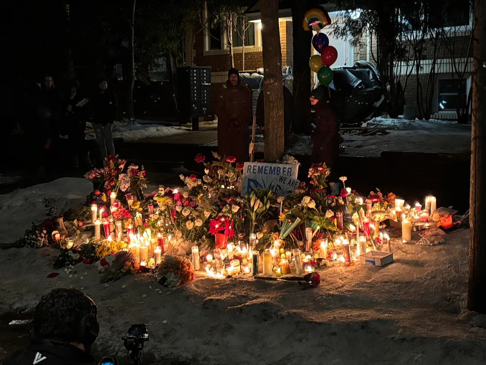
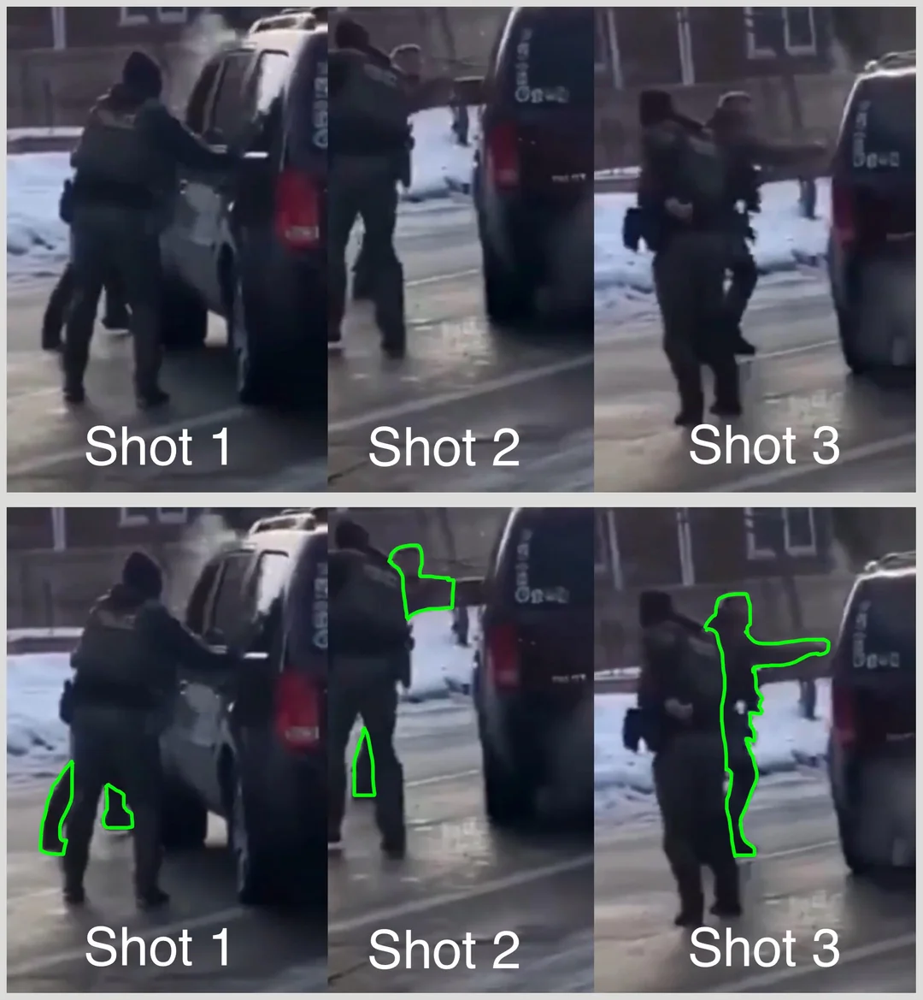

I live in Minneapolis, where on Jan 7 Renee Good was killed by an ICE officer while trying to flee from another officer attempting to force her car door open. Moments before, she is seen on camera waving out her window for the ICE vehicle to pass her using the open lane in front of her.

Neither the footage nor a single eyewitness account agrees with the [DHS official statement](https://www.reddit.com/r/Minneapolis/comments/1q6mg02). **All bystanders** perceived that she was scared and trying to escape.

[Now, the FBI have forced MN state authorities out of the case](https://www.mprnews.org/story/2026/01/08/fbi-will-investigate-after-ice-agent-shoots-renee-good-in-minneapolis)

## The footage

There are 3 angles.

A fourth video is labeled graphic: It is the longer cut of the left angle.  In it, you can see the ICE officer who killed Renee Good abandon the scene in a gold SUV without waiting for medical aid or other authorities arrive.

[Here is the Google Drive folder. Watch with caution.](https://drive.google.com/drive/folders/1Gb_IkGVK7WvsTAXfMvQUoM4a1P3VwXiu)

Here are the exact frames where shots are fired.

Kristi Noem said [at a conference](https://www.foxnews.com/politics/noem-condemns-alleged-attack-ice-agents-stuck-snow-minneapolis-act-domestic-terrorism) that

> As they were attempting to push the vehicle [out of the snow], she said a woman "attacked them and those surrounding them" and "attempted to run them over and ram them with her vehicle."

These videos show no such thing. The officers get out of a running vehicle, and could have chosen to drive by without stopping to confront her at all. Turn the sound on and you'll hear how alarmed bystanders are by the sudden escalation: nobody on either side of the conflict had clocked Renee as a threat or someone who was even behaving erratically or aggressively.

## Other information

* [Video: ICE blocks doctor from the shooting victim](https://www.huffpost.com/entry/latest-news-trump-maduro_n_695bb603e4b0d6beb5fd9469/liveblog_695ebd75e4b0b3db6e4d7e52)
* [Video: DHS officer stomps on memorial to Renee](https://x.com/tradinglara/status/2009279272188248438)
* [ICE officers are trained never to approach a vehicle from the front](https://www.nbcnews.com/news/us-news/live-blog/minnesota-ice-shooting-live-updates-rcna252852#rcrd95863)

## A final note

If this feels out of place or uncomforable, that is sort of the point. It is not possible to compartmentalize between our professional selves, our political selves, and who we are in our comunities and families.

I want these people out of my home.
