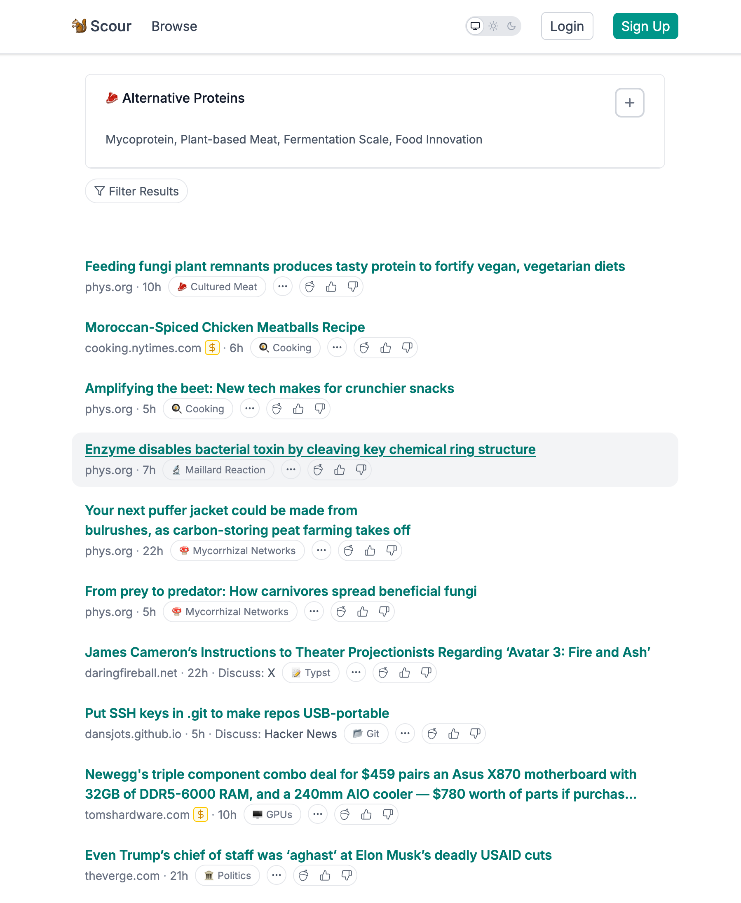

There was a HN thread earlier this year [cite thread]. and it lead me to a public dataset of over 24K RSS feeds [1] that ostensibly point at personal blogs.

## Garbage in, Garbage out

It will probably not surprise you that, by post volume, much of what's in here is junk.

Some of it is **earnest-yet-niche junk**: people sending their obscure movie reviews and book reviews and local play reviews from rochester area theaters out into the ether. The quantity of blogs dedicated to just, like, disecting old magazine covers vintage toys is counfounding. The internet is full of boomers penning 3-5 posts a week on blogger since the 20-teens. Their comment sections get _weird_ amounts of engagement.

Much of it hews stubbornly to a **content marketing** strategy that has been dead for years: Travel agents writing "travel blogs". Financial planners writing advice columns. Seeing the google analytics dashboards for some of these 1-man content mills would surely make me weep with rage. "How did you get here!?" I want to ask their visitors.

> Kagi search engine surfaces posts from the small web for relevant queries in its search results.

Ok kagi, show me this brighter future!

Finally some wholesome content. Isn't this so much better than Reddit?

##

## Prior Art

[**Scour**](https://scour.ing/about) so completely lacks a vision or purpose that I struggle to imagine why even a grifter would bother paying the hosting fees. Corporate news feeds appear next to obscure academic publications, clickbait, substacks, and affliate link fodder. Topics are lazily assembled bullshit: `pruning a peach tree` matches `systems programming` in only the smallest of embedding models.

|                                                               |                                                         |
| ------------------------------------------------------------- | ------------------------------------------------------- |
| Topic: **Systems programming**                                | Topic: **Alternative meat**                             |
|  |  |

**Kagi** hosts this random blog post page that has an infintesimally small chance of showing you something you something worthwhile. Cynically, I suspect the project is less of a committment to small web ideals and more of a marketing tool to get like-minded folks to sign up for a search engine that might (but probably wont) boost their content. The demo they built seems like little more than a slot machine

[**powrss.com**](https://powrss.com/) made me feel hopeful, then sad. By now I'd learned that the only way to achieve a worthwhile signal-to-noise ratio is curation. 24K feeds are a lost cause, but starting over should put you in a good position to exercise some editorial authority for the good of the community. powrss seems to have abdicated. At only 324 feeds, the post velocity is already at capacity. In a few months, without social feeatures (upvotes) or categories, it too will be beyond salvagable.

## Final thoughts

A more technical "how" post will follow. Embedding and search performance with Manticore is pretty interesting, actually.

[1] https://github.com/kagisearch/smallweb