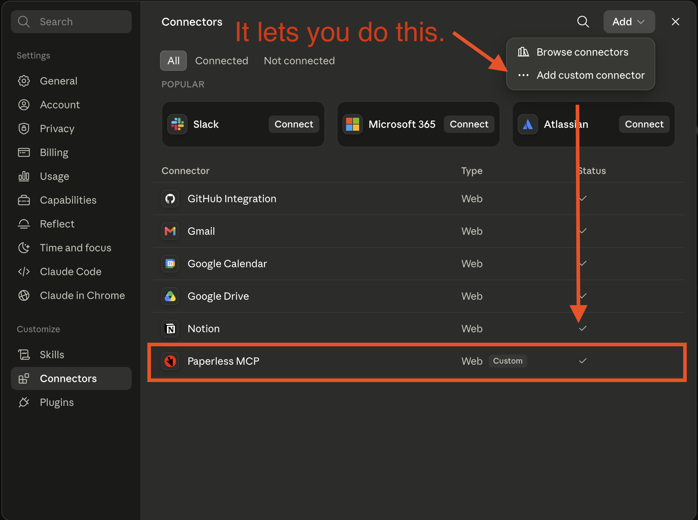
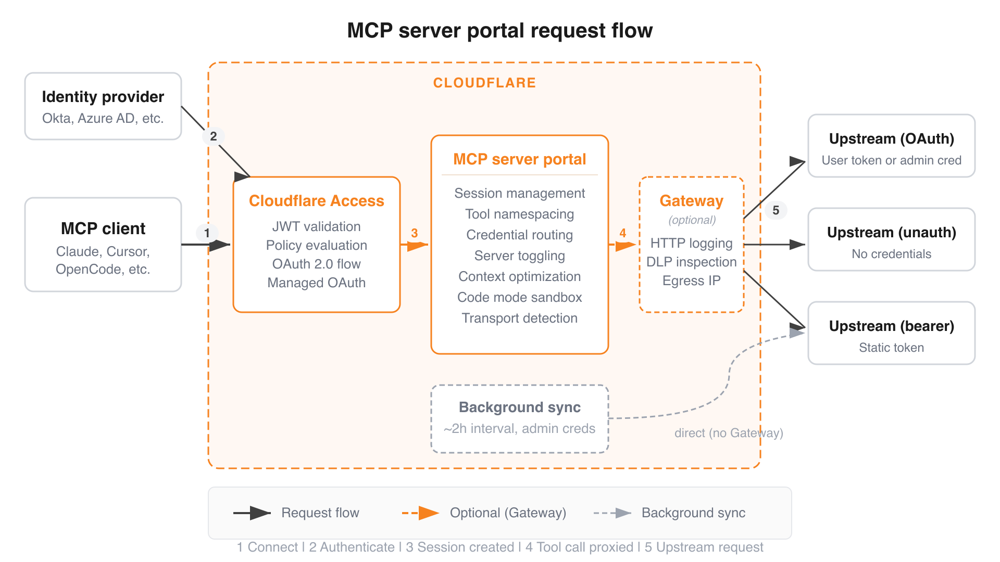

I recently got my documents in order with [Paperless-NGX](https://docs.paperless-ngx.com/). It's been on my todo list for years, but I mistakenly believed I would need a document scanner to make effective use of Paperless.  Not so!  Mobile camera scanning is pretty good, and so far I prefer the [QuickScan](https://www.quickscanapp.com/) app.

Almost immediately, I wanted an MCP connector. There are over [50 of them on github](https://github.com/search?q=paperless%20mcp&type=repositories), so I thought I could stand up a server, protect it with token auth, and plug it into the claude app.

Not so fast, bub. You need Oauth 2.0

## Custom MCP with Claude.ai or ChatGPT

For the sake of this post, I'm going to refer to Claude, but everything here applies to ChatGPT as well. We're talking about Claude.ai (or the mobile app) but not Claude code.


I do not use selfhosted AI tools like openclaw or hermes. If you do, any of the 50 existing options will work for you.


I want to use my paperless data with Claude. It requires that MCP servers, called "Connectors" in Claude, or "Plugins" in ChatGPT, run behind Oauth 2.0.

Crucially, you **must supply an Oauth 2.0 provider**. Most developers are familiar with building an Oauth client application that uses some cloud hosted identity provider like google to handle sign-in. It gives you a token pair with refresh that you can hang onto and use on behalf of that user.

In this situation, Claude is the client, and you must run the server. The reward/effort ratio was quickly tipping toward "not worth it".

Except Cloudflare now has a product that just... does this.

## Cloudflare MCP Server Portals

Cloudflare made a thing that lets you run an MCP server behind its identity services almost like a reverse proxy. [Read the documentation here.](https://developers.cloudflare.com/cloudflare-one/access-controls/ai-controls/mcp-portals/)

The cloudflare product offering is so large now that they should probably offer certification exams like AWS. They might even do that. I can't be bothered to check, because you can now [paste this into an agent](https://developers.cloudflare.com/agent-setup/) and get a lovely suite of skills that lets you very efficiently interrogate their documentation.

I've had a really good experience developing for the Workers platform using these skills. If I sound like a Cloudflare shill, it's probably because Matthew Prince replied to one of my tweets in 2014 and mailed me some stickers and that's apparently all it takes to buy my love.

So anyway, I happened to have the skills already installed and probably typed something like `"How can I run an mcp server with Oauth using cloudflare"`, expecting some convoluted assemblage of half a dozen vaguely named products like *Access* and *Zero Trust*.

But lo and behold, Cloudflare MCP Portals.

## Deploying it

I made [a detailed guide for setting this up](https://github.com/subdavis/paperless-mcp/blob/main/DEPLOY.md) but here's the gist of it. You don't even need to own a domain inside cloudflare.

- You have a Streamable HTTP MCP server running in cloudflare workers deployed with wrangler. It holds a token to access your Paperless instance, and translates MCP tool calls into API client calls.
- You click a bunch of bullshit in the Cloudflare console.
- You get an authenticated proxy multiplexer thing that stands in front of one (or many) MCP servers.
- You paste that URL into Claude, and when you authenticate, it sends you to Cloudflare to sign in and pick what servers or tools you want to expose to Claude.

If you follow the above guide closely, you can have a functioning Paperless MCP server in about 20 minutes.

Then you can get on with the important stuff:



## References

- Github Repo: https://github.com/subdavis/paperless-mcp
- Deployment Guide: https://github.com/subdavis/paperless-mcp/blob/main/DEPLOY.md
- Cloudflare Docs: https://developers.cloudflare.com/cloudflare-one/access-controls/ai-controls/mcp-portals/