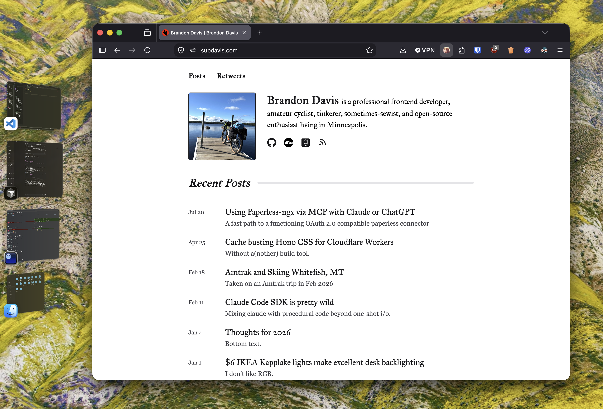

Something about the last two years has eroded my ability to focus. I find myself doing less deep work and more context switching.

I'll give you three guesses why.

It is what it is though. I used to be an [i3wm](https://i3wm.org/) zealot, and I remember it fondly, but I don't have the time or energy to sink into maintaining a functional linux desktop. In the last few weeks, I've started using Stage Manager - not for my DJ sets, but for my regular developer work.

[Stage manager](https://support.apple.com/guide/mac-help/use-stage-manager-mchl534ba392/mac) is a window management mode with 3 simple features:

* One window at a time (I don't use the grouping feature)
* A permanaent dock of open windows
* A single key combo (cmd+tab) to switch between them

For me it has two small annoyances.

1. Stages swap places when you switch them, they don't maintain a consistent order. It makes the animation less noisy, but it also means that windows are always moving around.
2. I'd like to be able to hotkey between stages by their index in the dock.

If you're feeling a tad harried and you have a Mac, give Stage Manager a try.
